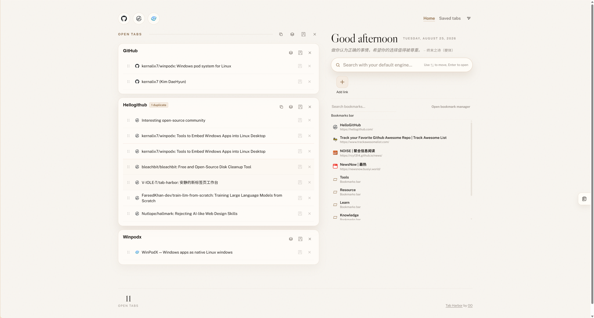

# Tab Harbor

[English](README.md) | [简体中文](README.zh-CN.md)

**A calmer Chrome new tab dashboard for open tabs, Chrome bookmarks, quick links, saved sessions, and lightweight todos.**

Tab Harbor turns Chrome's new tab page into a place where you can keep working. You immediately see what is already open, what should be saved for later, and what still needs your attention.

<p align="center">
  
</p>

## ✨ Core Highlights

- **Tabs are automatically organized by domain.** Tab Harbor groups open pages by domain, and moves homepage-style tabs into a dedicated `Homepages` group, so you can quickly see what you are actually working on.
- **You can still organize things around your own workflow.** When domain-based grouping is not enough, you can create manual groups, keep common quick links around, and jump back to the right section from the top icon rail.
- **Your Chrome bookmarks can stay on the desk, when you choose.** Bookmark access is optional and requested only from the visible **Show bookmarks** button. The shelf is a read-only view of Chrome's bookmark bar: Tab Harbor does not copy the tree into extension storage or include it in configuration exports.
- **Saved tabs now behave more like sessions.** You can choose what to save, add tabs to an existing saved session, restore them later, and keep the overview tidy with collapsed session groups when you do not need every tab in front of you.
- **Todos stay close, but out of the way.** The drawer lets you create, edit, delete, search, and archive todos without leaving the page.
- **It keeps getting calmer without getting heavier.** You can switch themes, tune transparency, adjust text and shortcut size, set a custom background, sleep inactive tabs, and clean duplicate tabs with one click, while extension-owned state stays in Chrome's local/session extension storage with no backend or account.

## 🖼️ Feature Tour

<table>
  <tr>
    <td width="33.33%" valign="top">
      <strong>Tabs and bookmarks</strong><br><br>
      
    </td>
    <td width="33.33%" valign="top">
      <strong>Saved sessions</strong><br><br>
      
    </td>
    <td width="33.33%" valign="top">
      <strong>Todos and quick jumping</strong><br><br>
      
    </td>
  </tr>
</table>

### Unified tab management

Tab Harbor organizes tabs more like a workspace: **domain-based groups, manual groups, quick access links, and fast jumping from the top icon rail**. If you want to clean up the browser a bit more, you can **also remove duplicate tabs with one click**.

Native Chrome group writes are coordinated serially by the background service worker. After the dashboard has initialized its grouping-rule snapshot once, creating, navigating, moving, or closing an ordinary tab—as well as installing or updating the extension, starting Chrome, or enabling sync—causes a window-scoped reconciliation even when no Tab Harbor page is open. Ordinary pages use the built-in normalized-domain resolver as their group identity: regular subdomains of one primary domain stay together, while different primary domains such as `hellogithub.com` and `github.com` stay separate; a cross-domain navigation also moves out of its old Tab Harbor-created group. The resolver includes common multi-part suffixes and known multi-tenant hosts, but it is not a complete Public Suffix List. When sync finds exactly one safe same-title native group whose current members all belong to the same logical group, it adopts that group instead of creating a duplicate. If several candidates match, Tab Harbor does not guess: a merge requires confirmation. A group created by Tab Harbor receives its initial collapsed state only when it is first created; later syncs preserve your manual expand/collapse choice. An adopted group keeps its own title, color, and collapsed state, is not auto-collapsed, and is not ungrouped when sync is turned off.

### Saved sessions

Pages you do not need right now can be **saved as sessions, added to an existing session, restored later, or kept collapsed for a quieter overview**.

### Todos and quick jumping

Tab Harbor also works as a tiny action layer: jot down todos, keep short descriptions, archive completed items, and jump back into the right group from the same page.

### Theme switching

When you want the page to feel more like your own workspace, you can **switch themes, tune transparency, adjust text and shortcut size, and use a custom background image**. In **Desk settings → Features** you can choose the **search engine** for the search bar (browser default, Google, Bing, Baidu, Sogou, DuckDuckGo, Brave, Yandex, or a custom URL), whether clicking a quick link **on the new-tab page** opens it in a **new tab** or in the **current tab**, and whether bookmark rows show **website favicons**. Bookmark favicons are off by default, and this choice is stored locally with your desk preferences. In **Desk settings → Appearance** you can fix quick links to **4 or 5 columns per row** (portrait stays automatic) so every link keeps its place.

### Search with a head start

The search field focuses itself whenever the Tab Harbor tab comes to the front, so "new tab → type → Enter" needs no click. Once you start typing, inline suggestions appear drawn from **open tabs, quick links, Chrome bookmarks (after permission is granted), saved sessions, and your recent history**. Pick an open tab to switch to it (Ctrl/Cmd-click opens a duplicate); bookmarks follow the current-page, background-tab, and new-window semantics described below, while other destinations open in a new tab. Keyboard arrows, Enter, and Escape work as expected. The panel stays quiet until you type, so the desk never shouts at you.

### Chrome bookmarks, by choice

The bookmark shelf mirrors Chrome's bookmark bar without becoming a second bookmark database. It prefers the folder Chrome marks as `bookmarks-bar`; if that marker is unavailable, it falls back to the first folder below the browser bookmark root. Top-level bookmarks, folders, and search results use the same compact single-column list for easier scanning; breadcrumbs keep nested navigation in place. Chrome bookmark events keep the in-memory view current. Tab Harbor does not create, rename, move, or delete bookmarks.

A normal click opens a bookmark in the current new-tab page. Ctrl/Cmd-click or middle-click opens it in a background tab, and Shift-click opens a new window. Tab Harbor blocks `javascript:`, `data:`, and `vbscript:` bookmark URLs. Any other syntactically valid URL is handed to Chrome; if Chrome cannot open it, the shelf shows feedback.

This shelf can replace the native **bookmarks bar as an everyday entry point**, so you may choose to hide Chrome's bookmarks bar yourself. It does not hide Chrome's tab strip: ordinary extensions cannot remove or hide that browser-owned UI.

<table>
  <tr>
    <td></td>
    <td></td>
  </tr>
  <tr>
    <td></td>
    <td></td>
  </tr>
</table>

### Manual sleep control

When you want to slow a tab down without losing it, you can **sleep individual tabs or put an entire group to sleep from the workspace itself**.

## 🌊 Why It Feels Different

Most new tab pages try to be a search box, a wallpaper, or a speed dial. Tab Harbor is closer to a lightweight browser control room. It keeps the messy reality of browsing visible, but turns it into something calmer and more actionable.

That also means it is intentionally lightweight. There is no backend, no sync account, and no extra app to open. It lives exactly where the browsing chaos already happens.

## ⚡ Quick Use

### Install from the Chrome Web Store

1. Open Tab Harbor in the Chrome Web Store:

   [Open Tab Harbor in the Chrome Web Store](https://chromewebstore.google.com/detail/tab-harbor/bkjihmeifgjifhkleokclpobdfnhiodf?authuser=0&hl=zh-CN)

2. Install it from the store.
3. Open a new tab in Chrome.

Due to package review, the actual version may appear a little later.

### Install with a coding agent

1. Give your coding agent this repo:

   ```text
   https://github.com/V-IOLE-T/tab-harbor
   ```

2. Ask it to install the extension.
3. Open a new tab in Chrome.

### Install manually

1. Clone this repo:

   ```bash
   git clone https://github.com/V-IOLE-T/tab-harbor.git
   ```

2. Open `chrome://extensions`
3. Turn on **Developer mode**
4. Click **Load unpacked**
5. Select the [`extension/`](extension/) folder in Chrome, or the repo root in Edge
6. Open a new tab

## 🔒 Fully Local

Tab Harbor runs entirely inside the extension. Open tabs come directly from Chrome, and saved sessions, todos, quick links, theme preferences, and layout state stay on your machine through `chrome.storage.local`. The Chrome group-to-window ownership map is session-only in `chrome.storage.session` and is not part of configuration export. If optional bookmark access is enabled, the bookmark tree is read from Chrome into memory for the shelf and search; it is not copied into local extension storage or exported.

If you publish this repo for other people, they get the code and assets, not your personal browsing data.

## 🛠️ Under the Hood

This is a Manifest V3 Chrome extension with a plain frontend stack and no build step required to use it. You can clone it, load it, and start using it without npm, without a dev server, and without standing up anything else.

## 🙏 Acknowledgements

- Tab Harbor is built on top of Zara's open-source project [tab-out](https://github.com/zarazhangrui/tab-out), which is the upstream repository and the starting point for this project.
- Thanks as well to the [Linux.do community](https://linux.do) for the ideas, feedback, and the kind of maker energy that helps projects like this keep evolving.

## 📄 License

MIT License
